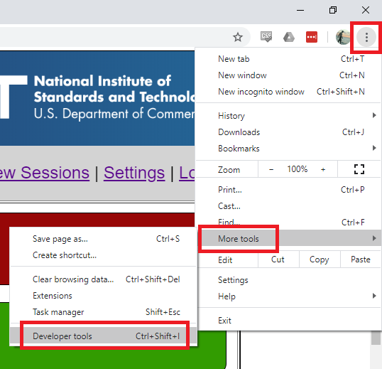
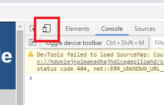
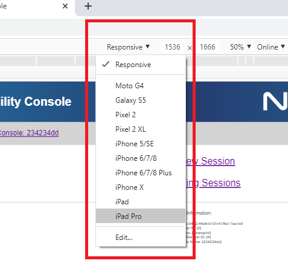
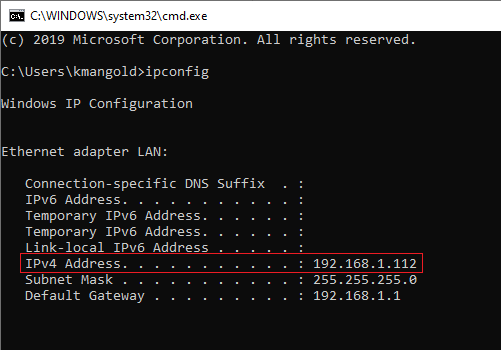
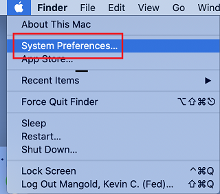
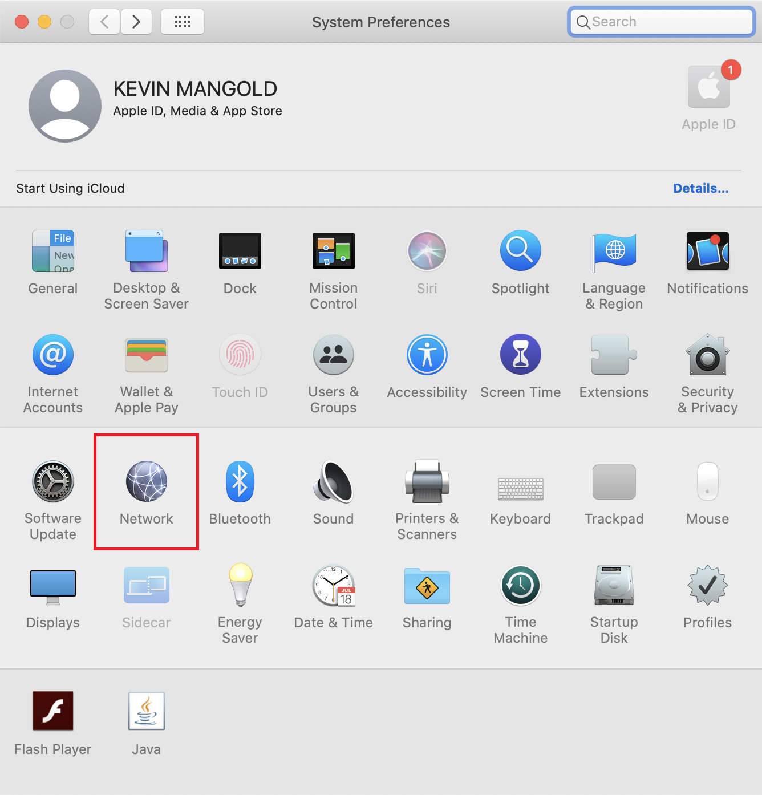
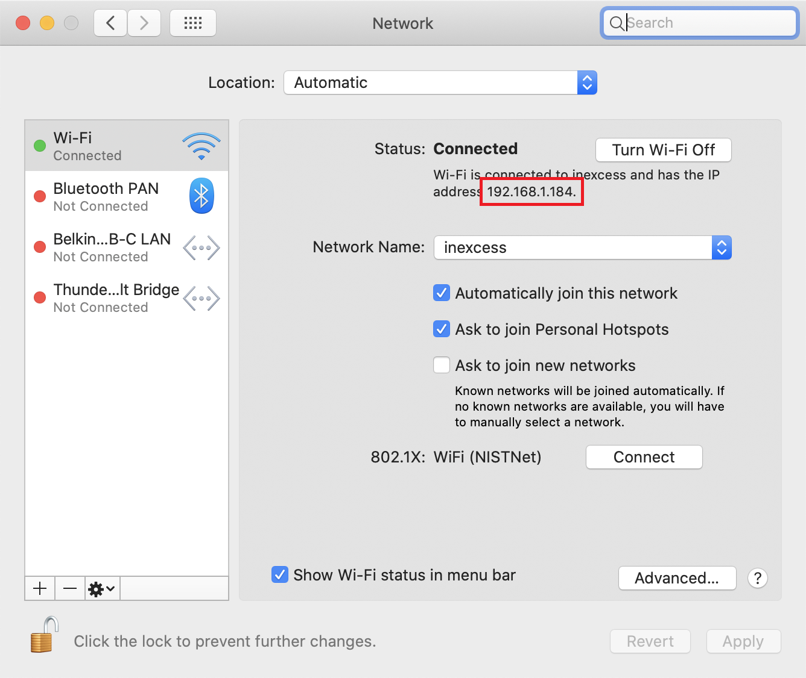

# Installation & Execution Instructions

1. [Installation](#Installation)
    1. [Verifying Successful Installation](#Verifying-Successful-Installation)
2. [Execution](#Execution)
    1. [Emulating a Tablet](#Emulating-a-Tablet)
    2. [Finding My IP Address](#Finding-My-IP-Address)
        1. [For a Windows host](#For-a-Windows-host)
        2. [For a Mac OS X host](#For-a-Mac-OS-X-host)

## Installation
1. Download and install Python 3.7+ (https://www.python.org/downloads/).
2. Open command line (in Windows, open Command Prompt. In Mac, open a Terminal window).
3. Test Python installation. Enter the following command into the command line:
    1. `python --version`
    2. If the version starts with a `2`, try again with `python3 --version`
    3. If `python3` shows that the version number starts with a `3`, you'll need to use `pip3` instead of `pip` for the next few steps.
4. Install Python third-party libraries by executing the following command(s) in the command line interface:
    1. `pip install -r requirements.txt` (might have to use sudo if permission is denied)
    
### Verifying Successful Installation
1. To test the installation, enter the following command in command line:
    1. `python --version` (if that fails, try `python3 --version`)
    2. If the version starts with a `2`, try again with `python3 --version`
    3. If `python3` shows that the version number starts with a `3`, you'll need to use `python3` instead of `python` for the next remaining steps.
2. You will see a line similar to `Python 3.8.2`. If so, everything was successful!

## Execution
1. In the command line interface (Command Prompt for Windows or Terminal for Mac OS X), change directories to where you downloaded / extracted the Operator Console files to.
    1. `cd <directory_path>`
2. Enter `python3 runserver.py`
    1. In some cases, the `python3` command will not work, replace `python3` with `python`.
3. You'll see a line that looks similar to `[27-Apr-20 11:40:27] [INFO] --  * Running on http://0.0.0.0:8080/ (Press CTRL+C to quit)`.
    1. If you are connecting from the same machine that is running the application, enter `http://127.0.0.1:8080/` or `http://localhost:8080/` into a web browser.
    2. If you are connecting from a tablet / mobile phone / or another computer, you'll need to find the IP address of the computer running the application. To do so, please see the [Finding My IP Address](#Finding-My-IP-Address) section.
4. A test user already exists. You can use this user or register a new one. The login information for this user is:
    - Username: `testuser`
    - Password: `p4ssw0rd`

### Emulating a Tablet
1. If you don't have Google Chrome installed, download and install the latest version.
2. Open Google Chrome.
3. Open Developers tools by clicking the breadcrumb menu in the upper right, expanding `More tools` and clicking `Developer tools`. You can also open it by pressing `Ctrl+Shift+I` on Windows or `Option+Command+I` on Mac OS X.

    
4. Toggle the device toolbar. You can click the icon (outlined in red below) or press `Ctrl+Shift+M` on Windows or `Command+Shift+M` on Mac OS X.

    
5. Choose the device to emulator. Click on the dropdown next to `Responsive` and select `iPad Pro`. The zoom should automatically adjust to show the entire view in your window. If not, you can change it manually by selecting the drop down (directly to the right of the two text boxes) and selecting a zoom that works best for you.  

    
6. Enter the address as you would described in Step 3 of the [Execution](#Execution) section.

### Finding My IP Address
#### For a Windows host
1. Click `Start` -> `Run`.
2. Enter `cmd` and hit Enter.
3. Inside command prompt, type `ipconfig` and hit Enter.
4. Look for a line that says `IPv4 Address`. This is the IP address of your computer (see image below).

    

#### For a Mac OS X host
1. Open `System Preferences` by clicking the Apple logo in the upper left corner of the screen.
2. Click on `System Preferences`

    
3. In the System Preferences dialog, click on the `Network` icon.

    
4. In the Network dialog, select the network you want to use (Wi-Fi, LAN, etc) and the IP address shows up on the right (see image below).
 
    
