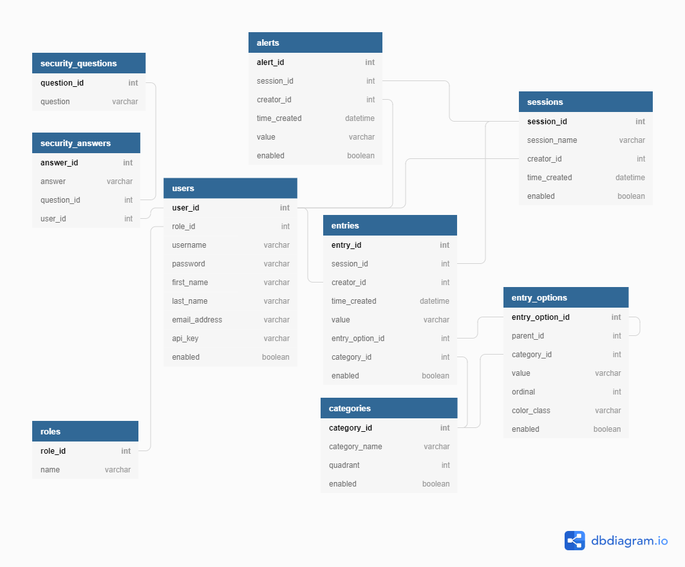

Last updated: 2020-05-06

Some Markdown References:
 
 - https://guides.github.com/features/mastering-markdown/
 - http://commonmark.org/help/
 - https://github.com/adam-p/markdown-here/wiki/Markdown-Cheatsheet
---
# Usability Console

## Table of Contents
 - [Introduction](#introduction)
 - [Software Requirements](#software-requirements)
 - [Quickstart](#quickstart)
 - [Overview](#overview)
    - [Directory Structure](#directory-structure)
 - [Database](#database)
 - [Configuration](#configuration)
 - [Source Code](#source-code)
 - [Web Browser Endpoints](#web-browser-endpoints)
 - [External Tool Integration](#external-tool-endpoints)

## Introduction
The purpose of this tool is to facilitate running and annotating usability and human factors studies. The simple design
and layout allows researchers to quickly annotate any actions or comments made by a participant by using a number of
preset buttons or a free-entry text field and/or control the application or device being studied (this may require 
additional development). Each action entered into the system is organized by study / participant, category, and is
timestamped for further analysis. For this application, category is defined as a *type of annotation*, which could be
a verbal comment, physical action / reaction, etc.

In addition to allowing an observer to enter data via a tablet or computer, depending on the type of device being
studied, has the ability to log events directly to the console through executing RESTful web service calls.

## Software Requirements
- Python 3.6 (or later)

Required packages:
- sqlite3
- Flask
- Flask-Session
- Jinja2
- Werkzeug, 0.16.1

## Quickstart
Run the `runserver.py` file, located at the root of the repository. Open a web browser to the configured URL (default
is http://127.0.0.1:8080/).

## Overview
### Directory Structure
```
.
|-- console             # Source code (python, sql, html, css, javascript) and static images
|-- Documentation       # Documentation
|-- config.py           # Basic configuration file (host, port, debug/verbose, etc.)
|-- LICENSE.md          # 
|-- README.md           #
└-- runserver.py        # Entry point of the application (run this!)
```

During the development and/or execution of this application, supporting files and/or directories may be created. One
example is `flask_session`, which contains cache/session data for each connected client / web browser.

## Database
This application uses the built-in `sqlite3` database to store data related to each user, session, entry, and entry
options (buttons), and entry categories. The image below shows how the database is structured.

[](https://dbdiagram.io/d/5c58ac623dfd9d0014c43501) 

Within the source code, there are helper methods built in to assist when interacting with the database. The provided methods are outlined in the table below: 

| Entity | Create | Read | Update | Delete | List All | Dis/Enable |
|:---:|:---:|:---:|:---:|:---:|:---:|:---:|
| Role         | &ndash; | X | &ndash; | &ndash; | X | &ndash; |
| User         | X | X | X | X | X | X |
| Session      | X | X | X | X | X | X |
| Alerts       | X | X | X | - | X | X |
| Entry        | X | X | X | X | X | X |
| Entry_Option | X | X | X | X | X | X |
| Category     | X | X | X | X | X | X |

X - Complete, &ndash; - Not Applicable

## Configuration
The `config.py` file contains variables used throughout the entire application to control certain aspects of program
flow. The variable names, meaning, and allowed values are described below.

### HOST
**Description**: The desired interface(s) the application should bind to.

**Allowed Values**: `0.0.0.0` or any valid ip address or host name

If the value is set to `127.0.0.1` or `localhost`, it will only
listen to requests coming from the host machine. If the value is set to `0.0.0.0`, the application will listen on ALL
network interfaces. If the value is set to a specific ip address or host name, it will only be accessible from those
specific names. For example, if the host machine has networking interfaces with the following ip addresses: `127.0.0.1`,
`192.168.1.20`, and `10.0.5.13` and `HOST` is set to `10.0.5.13`, a client can only access the application from 
`10.0.5.13` and not any other ip addresses.  

### PORT

**Description**: The desired port the application should bind to.

**Allowed Values**: Any integer value between 1 and 65535, inclusive.

### DEBUG

**Description**: Whether or not the application is running in DEBUG (i.e., verbose) mode.

**Allowed Values**: `True` or `False`

If this variable is set to `True`, the application will print additional information to the console as the application
runs and clients communicate with it. This information can be useful in debugging issues.

### RESET_DATABASE_ON_START

**Description**: Whether the application should reset the database upon start.

**Allowed Values**: `True` or `False`

When debugging the application, it may be useful to reset the  database when the application starts. If
`RESET_DATABASE_ON_START` is set to `True`, each time the application starts up, the database will be removed
and reset to its default settings and data. Additionally, all session data will be cleared. If this variable is set to 
`False`, all data will persist across different runs. 

### CLEAR_SESSION_ON_START

**Description**: Whether the remove all stored session data upon start.

**Allowed Values**: `True` or `False`

When debugging the application, it may be useful to clear all stored session data when the application starts. If
`CLEAR_SESSION_ON_START` is set to `True`, each time the application starts up, any stored session data will be removed.
Additionally, all session data will be cleared. If this variable is set to `False`, all data will persist across 
different runs.

## Source Code

Note: `flask_session` refers to the WSGI/Flask session while `session` refers to a single instance within the usability study

## Web Browser Endpoints
| Endpoint | Method | Status | Description |
|:---:|:---:|:---:|:---|
|`/`| GET | C | Displays the homepage of the Usability Console |
|`/login`| GET | C | Displays the form to login |
|`/login`| POST | C | Parses information and authenticates user |
|`/logout`| ***GET??*** | C | Logs current user out |
|`/register`| GET | C | Displays the form to register a new account |
|`/register`| POST | C | Parses information and creates new account |
|`/session`| GET | P | Views entries in the current session. If no session is selected, it redirects to `viewall` |
|`/session/viewall`| GET | C | Lists all enabled sessions |
|`/session/create`| GET | C | Creates a new session |
|`/session/create`| POST | C | Creates a new session |
|`/session/select/<int:session_id>`| GET | C | Sets the current session to the one associated with `session_id` |
|`/session/delete/<int:session_id>`| ***GET??***| NS | Deletes (disables) the session associated with `session_id` |
|`/session/console`| GET | C | Displays options to add new entries to the currently selected session |
|`/user` | GET | NS | Displays the settings page |
|`/user/viewall`| GET | C | Displays a list of all users, if permissioned |
|`/user/delete/<int:user_id>`| GET | C | Deletes (disables) the user associated with `user_id` |
|`/user/admin/<int:user_id>`| GET | P | Toggles whether user associated with `user_id` is an administrator or not |
|`/entry/post`| POST | C | Creates a new entry / alert with associated data |
|`/entry/modify/<int:entry_id>`| POST | C | Modifies the entry associated with `entry_id` |
|`/entry/delete/<int:entry_id>`| GET | C | Deletes (disables) the entry associated with `entry_id` |

## External Tool Endpoints

External clients and tools are able to connect to the operator console through RESTful web calls. Below is a table
listing the endpoints provided for external tool use, which HTTP method is needed, and a brief description of the
endpoint's purpose.

| Endpoint | Method | Description |
|:---:|:---:|:---|
|`/ext/<api_key>`| POST | Post event(s) to the current session |
|`/ext/<api_key>/new_session`| POST | Forces the console to establish a new session |
|`/ext/<api_key>/new_session/<session_name>`| POST | Forces the console to establish a new session named with a given name |
|`/ext/<api_key>/alerts`| GET | Gets all alerts as a list |

More information is available in [Examples for External Clients](./EXAMPLES.md).
